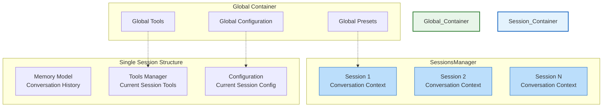
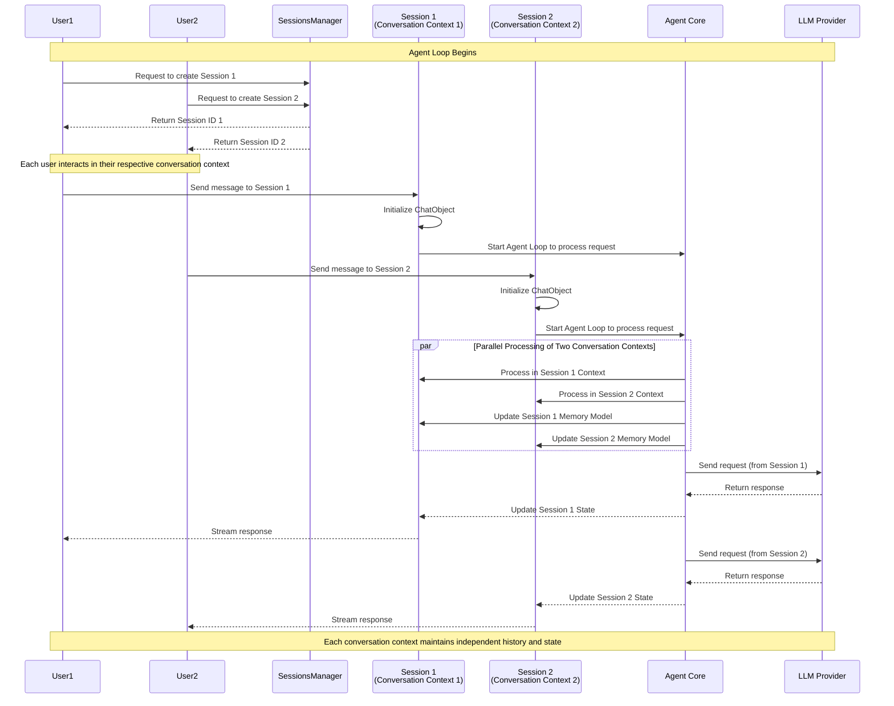

# 2.4 Project Architecture Understanding

## 2.4.1 Architecture Diagram

### Core Architecture

### Session and Global Data Container Architecture

#### Global Container and Session Conversation Context

## 2.4.2 Core Component Relationships

- **ChatObject**: The main interaction point that manages a single conversation
- **Configuration**: Controls how the core behaves (context usage, tool calling, etc.)
- **Events System**: Allows for hooks into the processing pipeline
- **Tools Manager**: Extends the agent's capabilities with external functions
- **Memory Model**: Maintains conversation context and history
- **Agent Core**: The central processing unit coordinating all components
- **SessionsManager**: Manages multiple isolated sessions, each as an independent conversation context
- **Session (Conversation Context)**: Stores all relevant information for a specific user or specific conversation, including memory model, tools, configurations, etc.

## 2.4.3 Agent Loop and Session Isolation Mechanism

1. **Session as Conversation Context**: Each Session represents an independent conversation context, storing all relevant information for a specific user or specific conversation
2. **Global Data Container**: SessionsManager manages all active conversation contexts, providing global resource sharing
3. **Agent Loop**: Inside each conversation context, the Agent Core executes the complete processing loop
4. **Context Isolation**: Data between different conversation contexts is completely isolated, ensuring conversation histories don't mix
5. **Global Resource Sharing**: Each conversation context can access resources from the Global container, but maintains its own independent state
