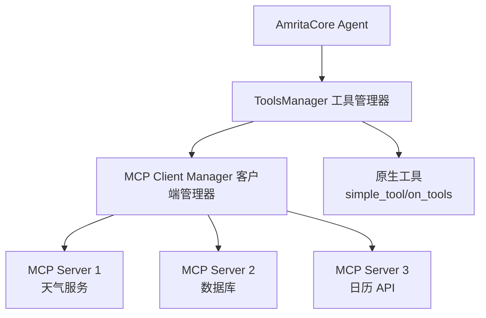

# MCP 服务集成

## 理解 AmritaCore 的 MCP 架构

**重要提示：** AmritaCore 将 MCP 作为**消费者/客户端**集成，而非 MCP 服务提供商。这意味着：

- ✅ **内置功能**: AmritaCore 可以连接并使用 MCP 服务器（外部工具/服务）
- ❌ **非内置功能**: AmritaCore 本身不原生向外部消费者提供 MCP 服务
- 🔧 **需要自定义实现**: 如果您需要将 AmritaCore 功能作为 MCP 服务暴露给外部，需要自行实现 MCP 服务器协议

## AmritaCore 中 MCP 的工作原理

AmritaCore 的 MCP 集成通过**包装 MCP 服务器并将其注入到工具管理器**来实现。以下是架构流程：



**工作流程：**

1. **连接建立**: `ClientManager` 通过脚本与 MCP 服务器建立连接
2. **工具发现**: 从每个 MCP 服务器获取可用工具列表
3. **格式转换**: 将 MCP 工具模式转换为 OpenAI 兼容格式
4. **注册**: 将 MCP 工具作为可调用函数注册到 `ToolsManager`
5. **执行**: 当 Agent 调用工具时，`MCPClient` 调用远程 MCP 服务器并返回结果

## 核心组件

### MCPClient

[`MCPClient`](../api-reference/classes/MCPClient.md) 类处理单个 MCP 服务器的连接：

```python
from amrita_core.tools.mcp import MCPClient

# 为特定 MCP 服务器创建客户端
client = MCPClient(server_script="/path/to/server.mcp")

# 连接并获取工具
async with client:
    tools = client.get_tools()  # 获取 OpenAI 格式的工具
    original_tools = client.get_original_tools()  # 获取原始 MCP 工具

    # 直接调用工具
    result = await client.simple_call("tool_name", {"param": "value"})
```

### ClientManager / MultiClientManager

[`ClientManager`](../api-reference/classes/ClientManager.md)（单例）管理多个 MCP 客户端：

```python
from amrita_core.tools.mcp import ClientManager

# 初始化管理器
manager = ClientManager()

# 注册并初始化多个服务器
scripts = [
    "/path/to/weather.mcp",
    "/path/to/database.mcp"
]
await manager.initialize_scripts_all(scripts)

# 通过工具名称获取客户端（处理路由）
client = await manager.get_client_by_tool_name("get_weather")

# 从特定客户端更新工具
await manager.update_tools(existing_client)
```

**关键特性：**

- **自动工具注册**: 来自已注册服务器的所有工具会自动添加到 `ToolsManager`
- **工具名称冲突解决**: 重复的工具名称会自动重映射（例如 `referred_42_search`）
- **客户端路由**: 自动将工具调用路由到正确的 MCP 服务器
- **生命周期管理**: 处理多个服务器的连接/断开连接

## 基于配置的设置

推荐的方法是通过 [`AmritaConfig`](../api-reference/classes/AmritaConfig.md) 配置 MCP 服务器：

```python
from amrita_core import create_agent, minimal_init
from amrita_core.config import AmritaConfig, FunctionConfig

# 配置 MCP 服务器
config = AmritaConfig(
    function_config=FunctionConfig(
        agent_mcp_client_enable=True,
        agent_mcp_server_scripts=[
            "./mcp-scripts/weather.mcp",
            "./mcp-scripts/database.mcp",
            "./mcp-scripts/calendar.mcp"
        ]
    )
)

# 使用配置初始化
await minimal_init(config)

# 创建 Agent - MCP 工具自动可用
agent = create_agent(
    base_url="https://api.example.com",
    api_key="your-api-key",
    model="gpt-4"
)
```

## 手动客户端管理

对于需要动态 MCP 服务器管理的高级场景：

```python
import asyncio
from amrita_core.tools.mcp import ClientManager, MCPClient

async def manual_mcp_setup():
    # 初始化管理器
    manager = ClientManager()

    # 选项 1：通过服务器脚本注册
    manager.register_only(server_script="/path/to/server.mcp")

    # 选项 2：注册预创建的客户端
    custom_client = MCPClient("/another/path.mcp")
    manager.register_only(client=custom_client)

    # 初始化所有已注册的服务器
    await manager.initialize_all()

    # 获取可用工具
    available_tools = manager.tools_manager.get_tools()
    print(f"可用工具：{list(available_tools.keys())}")

    # 稍后动态添加新服务器
    await manager.initialize_this("/dynamic/new-server.mcp")

    # 移除服务器
    await manager.unregister_client("/path/to/remove.mcp")
```

## 工具执行流程

当 Agent 调用 MCP 工具时：

```python
# 1. Agent 决定调用工具
# LLM 生成：{ "tool_calls": [{"name": "get_weather", "arguments": {"city": "NYC"}}] }

# 2. 框架路由到 MCP 客户端
# ClientManager.get_client_by_tool_name("get_weather") 找到正确的客户端

# 3. MCP 客户端调用远程服务器
result = await mcp_client.simple_call("get_weather", {"city": "NYC"})

# 4. 服务器处理并返回
# MCP 服务器执行：get_weather(city="NYC")
# 返回："Weather in NYC: Sunny, 25°C"

# 5. 结果发送回 LLM
# 工具响应附加到消息列表
# LLM 使用工具输出生成最终响应
```

## 错误处理

MCP 集成包含强大的错误处理机制：

```python
from amrita_core.tools.mcp import MCPClient

client = MCPClient("/path/to/server.mcp")

try:
    async with client:
        result = await client.simple_call("tool_name", {"param": "value"})
        # 成功：返回字符串结果
        # 失败：返回包含错误详情的 JSON
        # {"success": False, "error": "详细错误消息"}
except Exception as e:
    # 连接错误、初始化失败
    print(f"MCP 操作失败：{e}")
```

**处理的错误场景：**

- 服务器脚本未找到 → 记录错误，继续其他服务器
- 工具执行失败 → 向 LLM 返回结构化错误 JSON
- 连接超时 → 下次调用时自动重试
- 重复工具名称 → 自动重映射并记录警告日志

## 创建您自己的 MCP 服务器

由于 AmritaCore 不提供内置的 MCP 服务器功能，您需要创建自己的 MCP 服务器来暴露 AmritaCore 功能。以下是使用 MCP Python SDK 的最小示例：

```python
# my_amrita_server.py
from mcp.server import Server
from mcp.server.stdio import stdio_server
from mcp.types import Tool, TextContent

server = Server("amrita-tools")

@server.list_tools()
async def list_tools():
    return [
        Tool(
            name="amrita_chat",
            description="与 AmritaCore AI 助手聊天",
            inputSchema={
                "type": "object",
                "properties": {
                    "message": {
                        "type": "string",
                        "description": "发送给 AI 的消息"
                    }
                },
                "required": ["message"]
            }
        )
    ]

@server.call_tool()
async def call_tool(name: str, arguments: dict):
    if name == "amrita_chat":
        # 在这里集成 AmritaCore
        response = "Hello from AmritaCore!"  # 您的集成逻辑
        return [TextContent(type="text", text=response)]
    raise ValueError(f"未知工具：{name}")

async def main():
    async with stdio_server() as streams:
        await server.run(streams[0], streams[1])

if __name__ == "__main__":
    import asyncio
    asyncio.run(main())
```

然后从 AmritaCore 连接到它：

```python
from amrita_core.config import AmritaConfig, FunctionConfig

config = AmritaConfig(
    function_config=FunctionConfig(
        agent_mcp_client_enable=True,
        agent_mcp_server_scripts=["./my_amrita_server.py"]
    )
)
```

## 最佳实践

### 性能优化

- 在应用程序生命周期早期初始化 MCP 服务器
- 重用 `ClientManager` 实例（它是单例）
- 避免频繁的断开/连接循环
- 使用 `initialize_all()` 进行批量初始化

### 安全考虑

- 验证 MCP 服务器脚本路径
- 为远程 MCP 服务器实现身份验证
- 在发送到 MCP 服务器之前清理工具输入
- 监控工具执行时间和资源使用情况

### 开发提示

- 在集成之前独立测试 MCP 服务器
- 使用描述性的工具名称以避免冲突
- 在 MCP 服务器中实现适当的错误处理
- 记录工具调用以便调试

## 新的MCP客户端绑定方法（0.8.0+版本）

从0.8.0版本开始，AmritaCore提供了使用 `bound_to()` 方法直接将MCP客户端绑定到客户端管理器的简化方法。

### 使用 bound_to() 方法

[`bound_to()`](../api-reference/classes/MCPClient.md#bound_to) 方法提供了一种更直接、更受控的方式来注册MCP客户端：

```python
from amrita_core.tools.mcp import MCPClient, ClientManager

async def setup_mcp_client():
    # 创建MCP客户端
    client = MCPClient(server_script="/path/to/weather.mcp")

    # 获取全局客户端管理器
    manager = ClientManager()

    # 直接将客户端绑定到管理器
    await client.bound_to(manager)

    print("MCP客户端成功绑定到管理器！")
```

**`bound_to()` 的优势：**

- **原子操作**：绑定操作是原子的 - 要么完全成功，要么在失败时完全回滚
- **错误安全**：如果注册失败，客户端会自动注销以防止部分状态
- **直接控制**：提供对客户端注册的显式控制，无需通过脚本初始化
- **线程安全**：由于新的 [ContextThreadsafe](../api-reference/classes/ContextThreadsafe.md) 基类，该操作是线程安全的

### 对比：传统方法 vs 新方法

| 特性         | 传统方法 (`initialize_scripts_all`) | 新方法 (`bound_to`) |
| ------------ | ----------------------------------- | ------------------- |
| **使用场景** | 从配置/脚本批量初始化               | 直接客户端绑定      |
| **控制级别** | 高级别，配置驱动                    | 低级别，编程控制    |
| **错误处理** | 每脚本错误处理                      | 失败时原子回滚      |
| **灵活性**   | 限于基于脚本的设置                  | 完全的编程控制      |

### 带错误处理的完整示例

```python
import asyncio
from amrita_core.tools.mcp import MCPClient, ClientManager

async def robust_mcp_setup():
    client = MCPClient(server_script="./weather-service.mcp")
    manager = ClientManager()

    try:
        # 尝试绑定客户端
        await client.bound_to(manager)
        print("✅ MCP客户端绑定成功")

        # 使用客户端
        tools = client.get_tools()
        print(f"可用工具: {[tool.function.name for tool in tools]}")

    except Exception as e:
        print(f"❌ 绑定MCP客户端失败: {e}")
        # 客户端在失败时会自动清理
        raise

# 运行示例
asyncio.run(robust_mcp_setup())
```

**注意**：当需要在运行时动态注册MCP客户端或实现自定义MCP客户端管理逻辑时，`bound_to()` 方法特别有用。

## 相关文档

- [扩展与集成索引](./index.md) - 所有扩展机制概览
- [`ClientManager` API 参考](../api-reference/classes/ClientManager.md) - 完整的 API 文档
