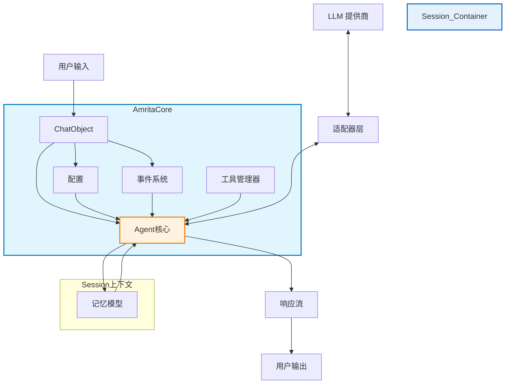
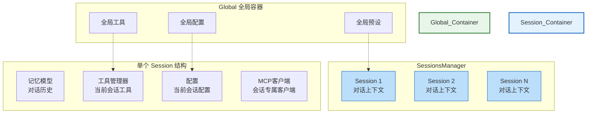
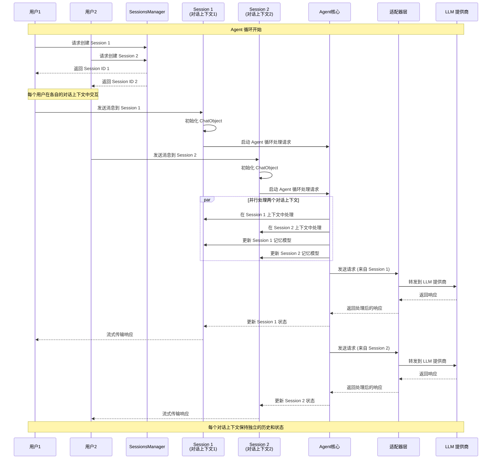

# 2.4 项目架构理解

## 2.4.1 架构图

### Core Architecture

### Session 与 Global 数据容器架构

#### Global 全局容器与 Session 对话上下文

## 2.4.2 核心组件关系

- **ChatObject**: 管理单个对话的主要交互点，同时也是Agent核心的执行单元
- **配置**: 通过 `AmritaConfig` 控制核心行为（上下文使用、工具调用、安全设置等）
- **事件系统**: 允许通过装饰器（如 `@on_precompletion` 和 `@on_completion`）挂钩到处理流水线，支持运行时依赖注入
- **工具管理器**: 通过 `MultiToolsManager` 使用外部函数扩展Agent功能，支持动态工具注册
- **记忆模型**: 维护对话上下文和历史记录，存储在每个Session的 `SessionData` 中
- **Agent核心**: 在 `ChatObject` 内部实现的中央处理逻辑，在Agent循环期间协调所有组件
- **SessionsManager**: 使用单例模式管理多个隔离的会话，每个会话包含独立的 `SessionData`
- **Session（对话上下文）**: 保存特定用户或特定对话的所有相关信息，包括记忆模型、工具、配置、MCP客户端和预设
- **适配器层**: 通过适配器模式抽象LLM提供商通信，实现厂商无关集成
- **MCP客户端**: 提供模型上下文协议客户端支持，用于外部服务集成

## 2.4.3 Agent 循环与 Session 隔离机制

1. **Session 作为对话上下文**: 每个 Session 代表一个独立的对话上下文，在其 `SessionData` 中存储特定用户或特定对话的所有相关信息
2. **Global 数据容器**: SessionsManager 管理所有活动的对话上下文，提供全局资源共享的同时保持会话隔离
3. **Agent 循环**: 在每个对话上下文内部，Agent 核心（在 ChatObject 中实现）执行完整的处理循环，包括事件处理、工具调用和记忆管理
4. **上下文隔离**: 通过独立的 `SessionData` 实例实现不同对话上下文之间的数据完全隔离，确保对话历史不混淆
5. **全局资源共享**: 每个对话上下文可以访问 Global 容器中的资源（全局工具、预设、配置），但拥有各自独立的状态，包括会话专属的工具、记忆和 MCP 客户端
6. **适配器抽象**: 适配器层提供厂商无关的 LLM 集成，允许相同的 Agent 逻辑与不同的 LLM 提供商配合工作而无需代码更改