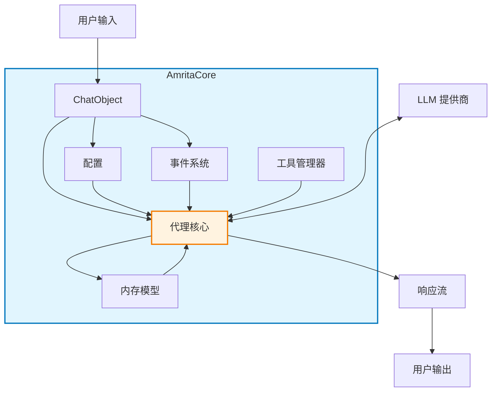
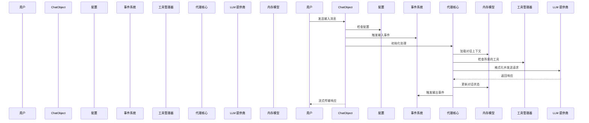

# 2.4 项目架构理解

## 2.4.1 架构图

## 2.4.2 核心组件关系

- **ChatObject**: 管理单个对话的主要交互点
- **配置**: 控制核心行为（上下文使用、工具调用等）
- **事件系统**: 允许挂钩到处理流水线
- **工具管理器**: 通过外部函数扩展代理功能
- **内存模型**: 维护对话上下文和历史记录
- **代理核心**: 协调所有组件的中央处理单元

## 2.4.3 数据流说明

1. 用户输入通过 ChatObject 进入
2. 配置确定处理行为
3. 输入触发事件系统中的各种事件
4. 代理核心从内存模型加载对话上下文
5. 代理核心根据输入检查是否需要调用任何工具
6. 处理后的输入发送到 LLM 提供商
7. LLM 的响应由代理核心处理
8. 内存模型使用新的对话状态进行更新
9. 输出事件可能会拦截并修改最终响应
10. 响应通过 ChatObject 流式传输回用户
