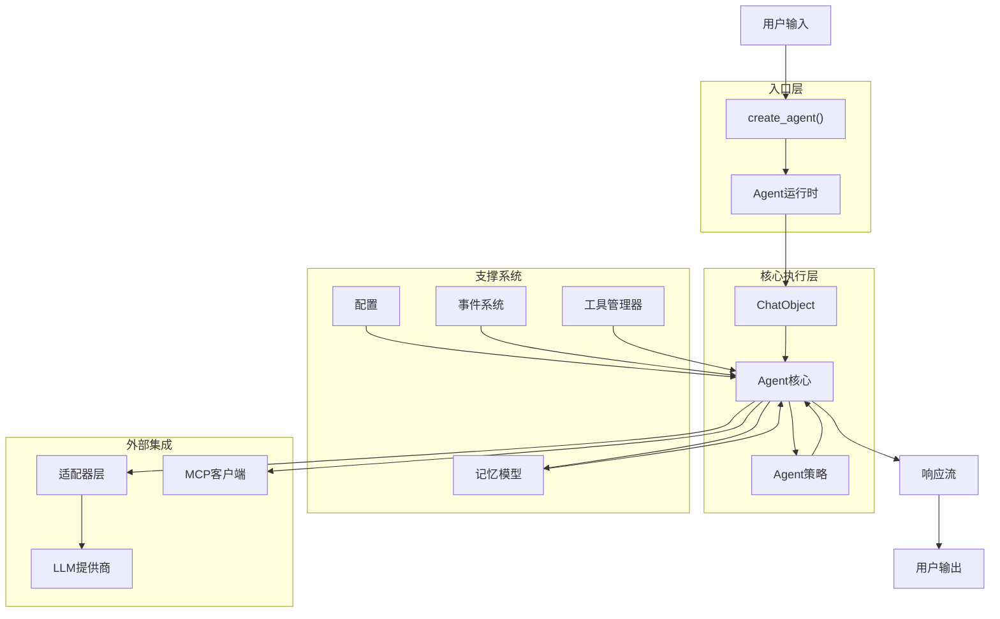
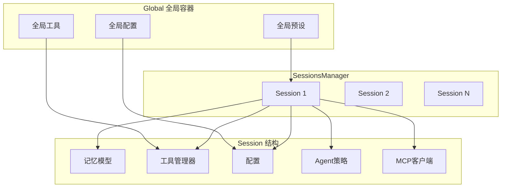
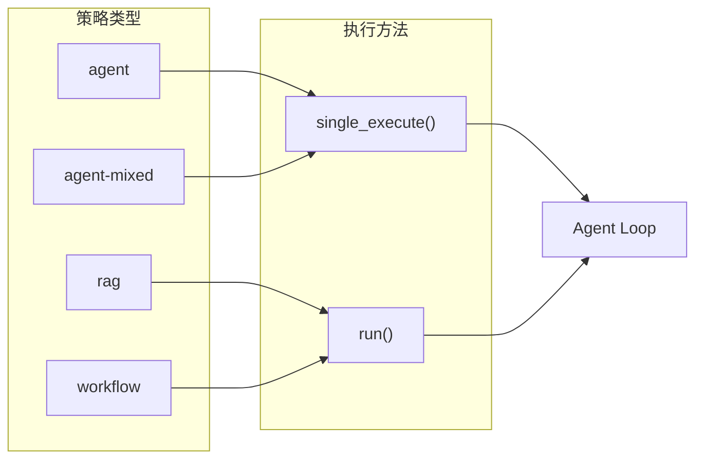
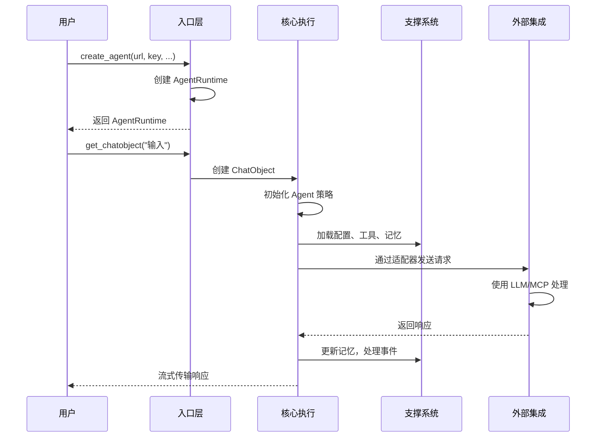

# 2.4 项目架构理解

## 2.4.1 架构图

### Core Architecture

```mermaid
graph TB
    subgraph "入口层"
        H[Agent运行时]
        Factory["create_agent()"]
    end

    subgraph "核心执行层"
        A[ChatObject]
        F[Agent核心]
        G[Agent策略]
    end

    subgraph "支撑系统"
        B[配置]
        C[事件系统]
        D[工具管理器]
        E[记忆模型]
    end

    subgraph "外部集成"
        Adapter[适配器层]
        LLM[LLM提供商]
        MCP[MCP客户端]
    end

    用户输入 --> Factory
    Factory --> H
    H --> A
    A --> F
    F --> G
    G --> F
    F --> Adapter
    Adapter --> LLM
    F --> MCP

    B --> F
    C --> F
    D --> F
    E --> F

    F --> 响应流[响应流]
    响应流 --> 用户输出
    F --> E
```

### Session 与 Global 数据容器架构

#### Global 全局容器与 Session 对话上下文

```mermaid
graph TB
    subgraph "Global 全局容器"
        G_Tools[全局工具]
        G_Presets[全局预设]
        G_Config[全局配置]
    end

    subgraph "SessionsManager"
        S1[Session 1]
        S2[Session 2]
        SN[Session N]
    end

    subgraph "Session 结构"
        Mem[记忆模型]
        Tools[工具管理器]
        Conf[配置]
        Strat[Agent策略]
        MCP_Client[MCP客户端]
    end

    G_Tools --> Tools
    G_Presets --> S1
    G_Config --> Conf

    S1 --> Mem
    S1 --> Tools
    S1 --> Conf
    S1 --> Strat
    S1 --> MCP_Client
```

### 基于策略的执行流程

```mermaid
graph LR
    subgraph "策略类型"
        AgentMode[agent]
        RAGMode[rag]
        WorkflowMode[workflow]
        MixedMode[agent-mixed]
    end

    subgraph "执行方法"
        SingleExecute["single_execute()"]
        RunMethod["run()"]
    end

    AgentMode --> SingleExecute
    MixedMode --> SingleExecute
    RAGMode --> RunMethod
    WorkflowMode --> RunMethod

    SingleExecute --> AgentLoop[Agent Loop]
    RunMethod --> AgentLoop
```

## 2.4.2 核心组件关系

- **入口层**: 为用户提供简化的交互接口
  - `create_agent()`: 工厂函数，使用最少参数创建 `AgentRuntime`
  - `AgentRuntime`: 高级包装器，封装复杂性并提供可重用的agent操作

- **核心执行层**: 处理主要的处理逻辑
  - `ChatObject`: 管理单个对话的主要交互点，协调所有组件
  - `Agent核心`: `ChatObject` 内部的中央处理逻辑，执行完整的agent循环
  - `Agent策略`: 定义执行模式的抽象基类，支持四种策略类别

- **支撑系统**: 提供基本服务和数据管理
  - `配置`: 通过 `AmritaConfig` 控制系统行为
  - `事件系统`: 通过装饰器和依赖注入在处理流水线中启用钩子
  - `工具管理器`: 通过动态注册使用外部函数扩展功能
  - `记忆模型`: 在会话数据中维护对话上下文和历史

- **外部集成**: 处理与外部系统的通信
  - `适配器层`: 抽象LLM提供商通信，实现厂商无关集成
  - `MCP客户端`: 提供模型上下文协议支持，用于外部服务集成

- **数据容器**: 管理数据隔离和共享
  - `Global 全局容器`: 存储所有会话可访问的共享资源
  - `Session 上下文`: 维护具有独立状态的隔离对话上下文

## 2.4.3 Agent 循环与 Session 隔离机制

```mermaid
sequenceDiagram
    participant User as 用户
    participant Entry as 入口层
    participant Core as 核心执行
    participant Support as 支撑系统
    participant External as 外部集成

    User->>Entry: create_agent(url, key, ...)
    Entry->>Entry: 创建 AgentRuntime
    Entry-->>User: 返回 AgentRuntime

    User->>Entry: get_chatobject("输入")
    Entry->>Core: 创建 ChatObject
    Core->>Core: 初始化 Agent 策略
    Core->>Support: 加载配置、工具、记忆
    Core->>External: 通过适配器发送请求
    External->>External: 使用 LLM/MCP 处理
    External-->>Core: 返回响应
    Core->>Support: 更新记忆，处理事件
    Core-->>User: 流式传输响应
```

### 基于策略的执行模式

1. **分层架构**: 系统遵循清晰的分层结构，具有明确的层次：
   - 入口层: 简化的用户界面
   - 核心执行层: 主要处理逻辑
   - 支撑系统: 基本服务
   - 外部集成: 第三方通信
   - 数据容器: 状态管理

2. **策略模式实现**: 四种执行策略提供灵活的行为：
   - **'agent'**: 使用 `single_execute()` 进行迭代式工具调用，逐步执行
   - **'rag'**: 使用 `run()` 进行检索增强生成，使用最小上下文
   - **'workflow'**: 使用 `run()` 对工具调用和上下文管理进行完全手动控制
   - **'agent-mixed'**: 使用 `single_execute()` 进行动态模式处理，可在RAG和Agent模式之间切换

3. **会话隔离**: 每个对话通过独立的会话上下文保持完全隔离，同时在需要时共享全局资源。

4. **事件驱动设计**: 系统使用装饰器和事件处理器允许在不修改核心逻辑的情况下扩展行为。

5. **厂商无关性**: 适配器层确保相同的agent逻辑可以与不同的LLM提供商配合工作而无需代码更改。

6. **模板支持**: [Jinja2模板](../../concepts/jinja2-templates.md)基于上下文、记忆和配置启用动态提示构建。
