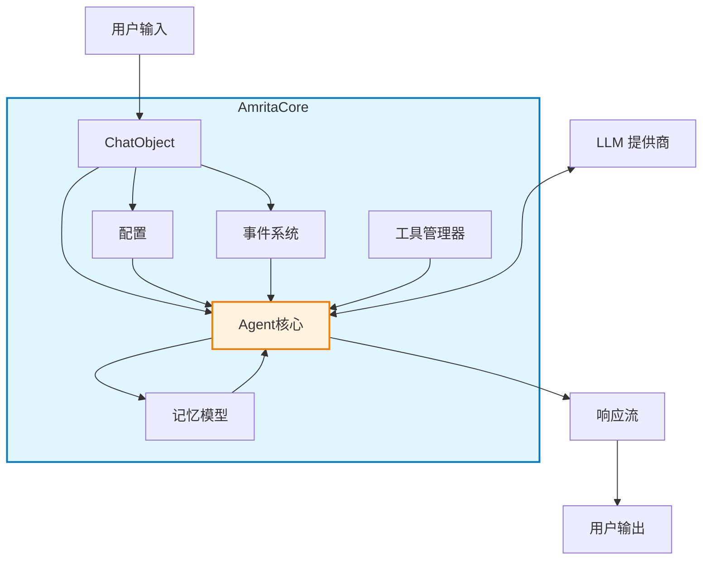
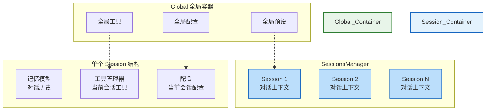
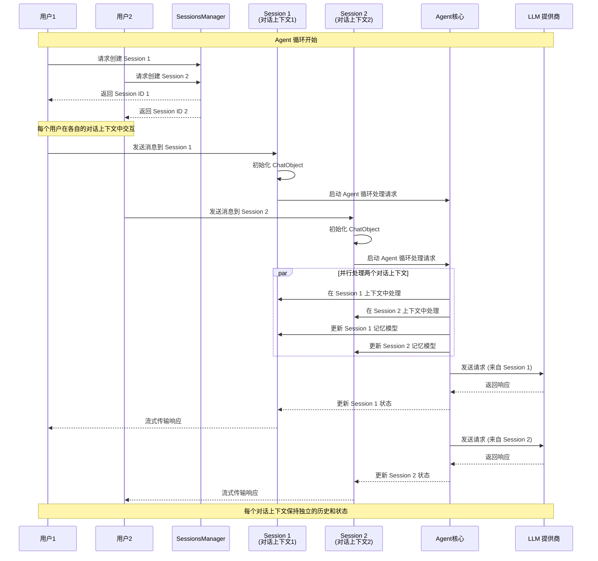

# 2.4 项目架构理解

## 2.4.1 架构图

### Core Architecture

### Session 与 Global 数据容器架构

#### Global 全局容器与 Session 对话上下文

## 2.4.2 核心组件关系

- **ChatObject**: 管理单个对话的主要交互点
- **配置**: 控制核心行为（上下文使用、工具调用等）
- **事件系统**: 允许挂钩到处理流水线
- **工具管理器**: 通过外部函数扩展Agent功能
- **记忆模型**: 维护对话上下文和历史记录
- **Agent核心**: 协调所有组件的中央处理单元
- **SessionsManager**: 管理多个独立的会话，每个会话都是一个独立的对话上下文
- **Session（对话上下文）**: 保存特定用户或特定对话的所有相关信息，包括记忆模型、工具、配置等

## 2.4.3 Agent 循环与 Session 隔离机制

1. **Session 作为对话上下文**: 每个 Session 代表一个独立的对话上下文，保存特定用户或特定对话的所有相关信息
2. **Global 数据容器**: SessionsManager 管理所有活动的对话上下文，提供全局资源共享
3. **Agent 循环**: 在每个对话上下文内部，Agent 核心执行完整的处理循环
4. **上下文隔离**: 不同对话上下文之间的数据完全隔离，确保对话历史不混淆
5. **全局资源共享**: 每个对话上下文可以访问 Global 容器中的公共资源，但拥有各自独立的状态
